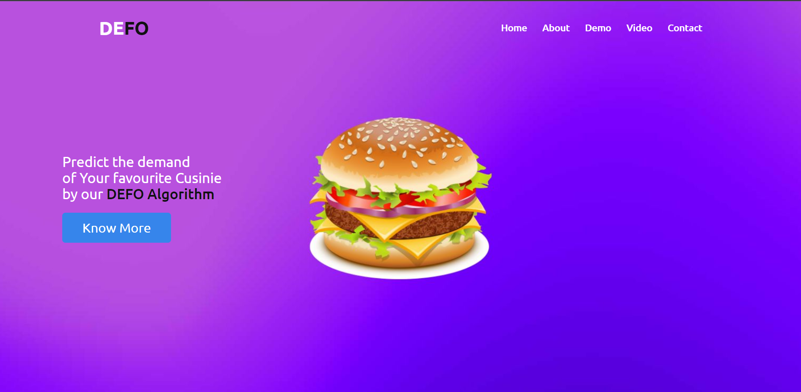

<h1><b>DEFO</b>, A Restaurant_Cuisine_Demand_Predictor </h1>
-------------------------------------------------------------------------------------------------------------------------------------------------------------------------
This project is implemented using ML to predict the demand of the given dataset concerned with reviews of customers of a food company. The data was analysed using python and certain trends, findings were discovered in the process. Three ML models were trained namely <b>Random Forest regressor, XGB Regressor, Extra Trees Regressor</b>. Extra Trees Regressor shows highest r2_score with Random Forest regressor following it.

<h2>ALGORITHMS r2_scores: </h2>
-------------------------------------------------------------------------------------------------------------------------------------------------------------------------
<ul>
  <li> Random Forest regressor :- 0.9286105766896842 </li>
<li>  XGB Regressor :- 0.7636484968153312 </li>
  <li> Extra Trees Regressor :- 0.9385324707057678 </li>
 </ul>

## Future Scope:
-------------------------------------------------------------------------------------------------------------------------------------------------------------------------
Time Series predictions can be done on the data for more accurate understanding and better accuracy.

# DEPLOYMENT LINK: https://cruisnien.herokuapp.com/
# TECH STACK
-------------------------------------------------------------------------------------------------------------------------------------------------------------------------

# Built With 

* [HTML5](gtml.com)
* Visualisation and modeling tools: Jupyter notebook, python
* ML modules: Scikit-Learn
* Git, OBS, pickle, Heroku Cloud, GitHub
* [Bootstrap](https://getbootstrap.com)
* [JQuery](https://jquery.com)

(<a href="#top">back to top</a>)

